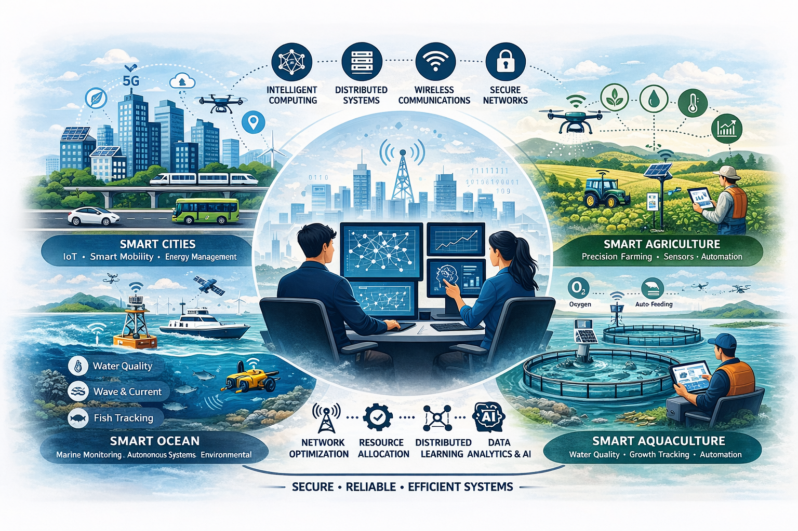

::: {.lead}
We are a research group led by [Dr. Dinh Nguyen](https://www.tcd.ie/scss/people/academic-staff/nguyenva/){.text-primary .text-decoration-none .fw-bolder} at the [School of Computer Science and Statistics, Trinity College Dublin, Ireland](https://www.tcd.ie/scss/){.text-primary .text-decoration-none .fw-bolder}. Our research focuses on [networks, distributed systems, wireless communications, and intelligent computing]{.fw-bolder}, with an emphasis on designing scalable, reliable, and secure communication infrastructures for next-generation digital systems.

We develop novel methodologies in areas such as [resource allocation, network optimization, distributed learning, and system intelligence]{.fw-bolder}, aiming to improve performance, efficiency, and robustness in complex and dynamic environments. Our work bridges theoretical foundations and practical implementations, with applications spanning modern communication networks and emerging computing paradigms.

In addition to core research in communication and computing systems, we actively pursue interdisciplinary collaborations across domains, including [smart cities, smart aquaculture, agriculture, and smart ocean systems]{.fw-bolder}. In these areas, we leverage [data-driven, AI-enabled, and distributed solutions]{.fw-bolder} to address real-world challenges such as sustainability, environmental monitoring, resource management, and intelligent infrastructure development.
:::

{.hero}
