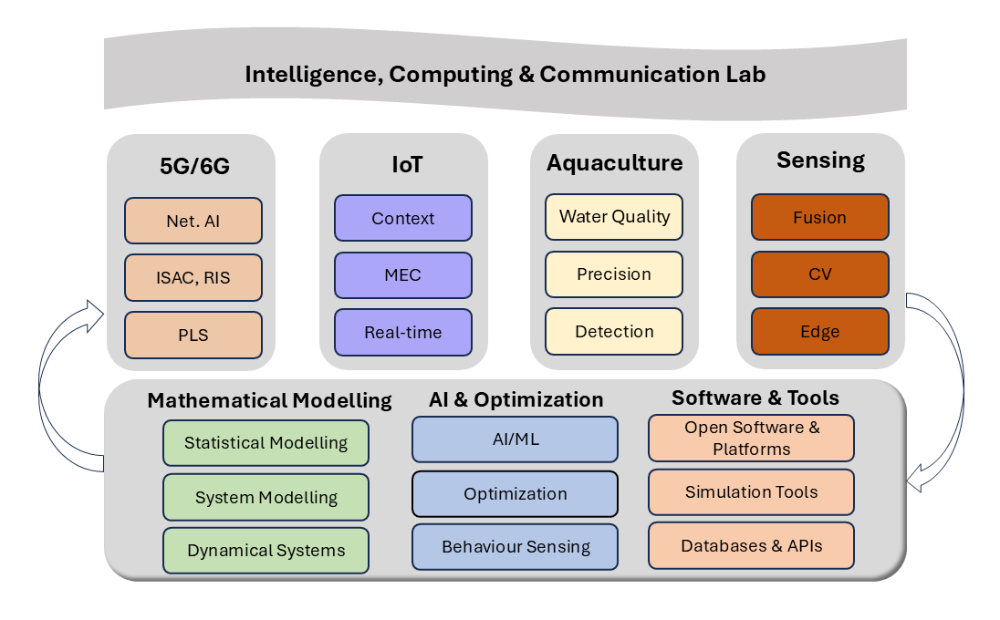

```{=html}
<nav aria-label="breadcrumb">
  <ol class="breadcrumb">
    <li class="breadcrumb-item"><a href="index.html">Home</a></li>
    <li class="breadcrumb-item active" aria-current="page">Research</li>
  </ol>
</nav>
```

## Research Funding

### Current Funding

- *"NextGShield – Proactive AI Resilience in NextG Open Wireless"*
    - Australia-Vietnam Strategic Technologies Centre (AVSTC)
    - PI: **Dinh Nguyen**
    - 08/2025 -- 01/2026

### Completed Funding

- *"Optimizing Energy Efficiency in Mobile Edge Systems with AI-Powered Sustainable Solutions"*
    - VinUniversity
    - PI: **Dinh Nguyen**
    - 01/2025 -- 01/2026

- *"Enhancing the Performance of 6G Open RAN Integrating Edge Computing and Network licing"*
    - National Foundation for Science and Technology (NAFOSTED), ietnam
    - PI: **Dinh Nguyen** (not sign the contract)
    - 2024 -- 2026
    
- *"Resilience-Aware Edge Computing for Massive and Secure Internet-of-Things Networks"*
    - Seed grant, VinUniversity
    - PI: **Dinh Nguyen**
    - 2023 -- 2025

## Research Framework



### Research Areas

The substantive focus of our research is on the development of intelligent and connected aquaculture systems through the integration of advanced communication technologies, sensing, and data-driven decision-making. The four pillars of this work are 5G/6G communication, Internet of Things (IoT), sensing technologies, and aquaculture applications. 

In studying 5G/6G, the research investigates how next-generation wireless networks can support reliable, low-latency, and large-scale connectivity for remote and offshore aquaculture environments. This includes challenges related to coverage, energy efficiency, and hybrid underwater–terrestrial communication systems. In studying IoT, the focus is on the deployment and coordination of distributed sensor and actuator networks that enable real-time monitoring and control of aquaculture operations. This involves issues such as sensor placement, data transmission reliability, and system scalability.

In studying sensing, the research examines the acquisition and interpretation of environmental and biological data, including water quality parameters, fish behavior, and system conditions. Particular attention is given to the constraints of underwater sensing, such as signal attenuation, noise, and long-term sensor reliability. In studying aquaculture functionality, the research explores how these technologies contribute to improved productivity, sustainability, and automation, including applications such as feeding optimization, disease detection, and environmental management. Overall, these pillars collectively address how intelligent systems can enhance both operational efficiency and ecological responsibility in aquaculture.

### Methodological Foundation

Supporting these pillars is a comprehensive methodological foundation that integrates mathematical modelling, artificial intelligence and optimization, and software-based implementation. The mathematical modelling aspects focus on the development of analytical and simulation models to describe system behavior, including network performance, energy consumption, and environmental dynamics. These models often involve differential equations, probabilistic analysis, and system-level abstractions that enable prediction and performance evaluation under varying conditions.

The artificial intelligence and optimization aspects focus on extracting insights from data and enabling intelligent decision-making. Machine learning techniques are applied to tasks such as time-series prediction, anomaly detection, and behavioral analysis, while optimization methods are used to improve resource allocation, feeding strategies, and network efficiency. These approaches aim to balance multiple objectives, such as maximizing productivity while minimizing cost and environmental impact.

The software and computational aspects emphasize the implementation, simulation, and validation of proposed systems using modern tools and platforms. This includes the use of programming environments such as Python, simulation tools like MATLAB and NS-3, and machine learning frameworks such as TensorFlow and PyTorch. Together, these methodologies provide a cohesive framework for designing, analyzing, and deploying intelligent aquaculture systems.
